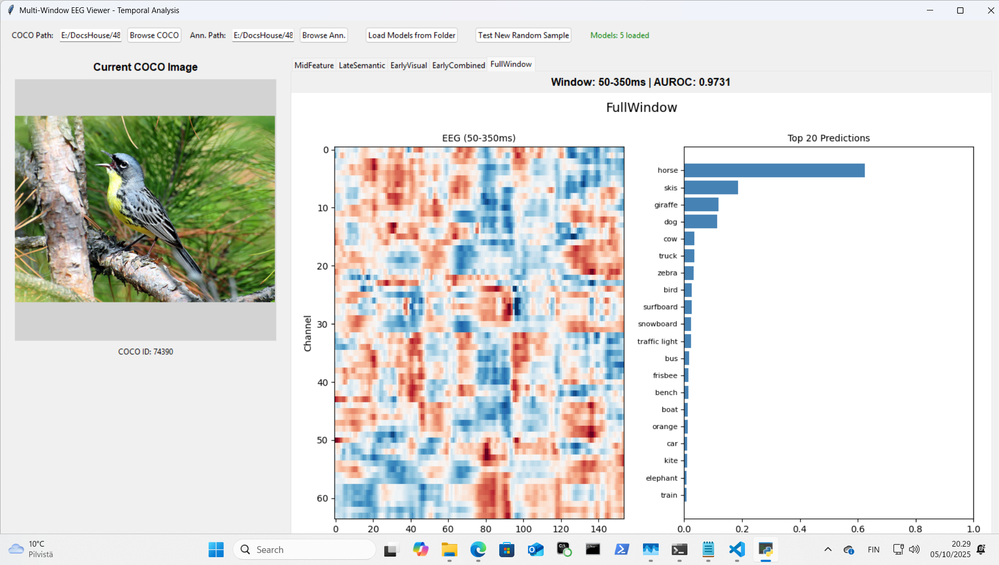

# Multi-Window EEG Viewer

Tools for training and comparing EEG signal detection models across different temporal windows.

# What This Does

Fast_Train_Multi_Window.py: Trains 5 separate models on the same EEG data using different time windows:

50-150ms (early visual processing)
150-250ms (mid-level features)
250-350ms (late semantic processing)
50-250ms (combined early)
50-350ms (full baseline)

Each model gets saved as a separate .pth file with the time window in the filename.
MultiWindowEEGviewer.py: Loads all trained models and displays their predictions side-by-side for the same EEG trial. Shows:

The original COCO image

Top 20 category predictions from each model

EEG heatmaps for each time window

This lets you see how predictions change across temporal windows - e.g., does the 50-150ms model predict different categories than the 250-350ms model for the same image?

# Requirements

pip install torch torchvision datasets scipy matplotlib pillow scikit-learn

Python 3.8+ with CUDA recommended for training (CPU will be slow).

# Data Setup

Alljoined EEG Dataset: Downloads automatically when you run the scripts.

Dataset: Alljoined/05_125

COCO Dataset (manual download required):

Download COCO 2017 images from cocodataset.org

You need train2017.zip and/or val2017.zip

Download annotations: instances_train2017.json (included in "2017 Train/Val annotations [241MB]")
Extract to a folder structure like:

   coco/
     train2017/
     val2017/
     annotations/
       instances_train2017.json

# Usage

1. Train Multiple Models
python Fast_Train_Multi_Window.py

Click "Browse COCO" and select your COCO images folder
Click "Browse Annotations" and select instances_train2017.json
Set epochs (default: 1000) and other parameters
Click "Train 5 Multi-Window Models"
Wait - this will train 5 models sequentially (several hours on GPU)

Models save as: signal_detector_50_150ms_EarlyVisual.pth, etc.

2. View Multi-Window Predictions

python MultiWindowEEGviewer.py

Set COCO path and annotations path
Click "Load Models from Folder" and select the folder containing your .pth files
Click "Test New Random Sample" to load a random EEG trial
Switch between tabs to see predictions from different time windows

You are going to need models to point to. I have models that were trained for 250 
epochs at: 

https://huggingface.co/Aluode/MultiTimeWindowEEGModel 

Frankly they are not great but they work. You can train more if you want to. 

# What You'll See

Each tab shows a different model's interpretation of the same EEG trial:

Early windows (50-150ms) often predict based on visual features
Late windows (250-350ms) may show more semantic/contextual predictions
Sometimes all windows agree, sometimes they diverge

This is exploratory - you're looking at patterns, not ground truth decoding.

# Notes

Models are 23 to 37MB each 
Training uses the same architecture (CNN+Transformer) with different input window sizes
The viewer shows top 20 predictions ranked by probability
Category predictions are from 38 object classes (animals, vehicles, food, outdoor objects)

# Links: 

Alljoined 05 125 Dataset:

https://huggingface.co/datasets/Alljoined/05_125

COCO Annotations**: Required for multi-label ground truth (instances_train2017.json).

Download: COCO Dataset Official Site

(select "2017 Train/Val annotations [241MB]").

# License

# MIT
